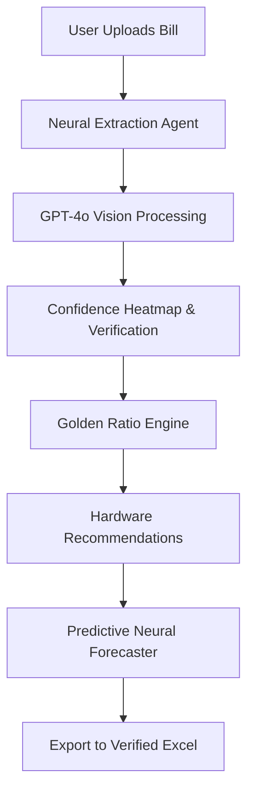

# EnergyBae AutoLoad AI (V3.0 Ultimate)

An Enterprise-grade Agentic Document Intelligence platform built for **EnergyBae**. This application revolutionizes residential and industrial energy auditing by combining high-fidelity OCR, neural forecasting, and a proprietary "Golden Ratio" recommendation engine.

## 🚀 The Revolution

This isn't just a calculator. It is a **Strategic Energy Advisor** that:
- **Neural Extraction:** Uses GPT-4o Vision to extract billing data with >95% accuracy.
- **Agentic Auditor:** A real-time "Neural Stream" console that shows the AI's Chain-of-Thought during processing.
- **Neural Forecaster:** Predicts next-quarter consumption using weighted seasonal regression models.
- **Golden Ratio Engine:** Recommends the optimal mix of Solar and Wind (HAWT/VAWT) based on historical load variance.
- **Human-in-the-Loop:** A professional verification dashboard to ensure 100% data integrity before Excel generation.

## 🛠 Tech Stack

- **Framework:** Next.js 14 (App Router)
- **Styling:** Tailwind CSS + Framer Motion (Glassmorphism UI)
- **AI/ML:** OpenAI API (Vision Models) + Custom Regression Logic
- **Data Visualization:** Recharts (Analytics & Forecasting)
- **Document Processing:** `exceljs` (Surgical Excel Injection)
- **Icons:** Lucide-React

## 🏗 Architecture

## 🔋 Hardware Recommendations

The platform is vertically integrated with the **EnergyBae Catalog**:
- **Windistar 400 HAWT/VAWT** for residential base loads.
- **Whisper 200/500** for industrial consistency.
- **Tier 1 Monocrystalline PERC** for peak solar efficiency.

## 📦 Getting Started

1. Clone the repository
2. Install dependencies: `npm install`
3. Set your `OPENAI_API_KEY` in `.env.local`
4. Run development server: `npm run dev`

---
*Built for the EnergyBae AI Engineer Internship.*
