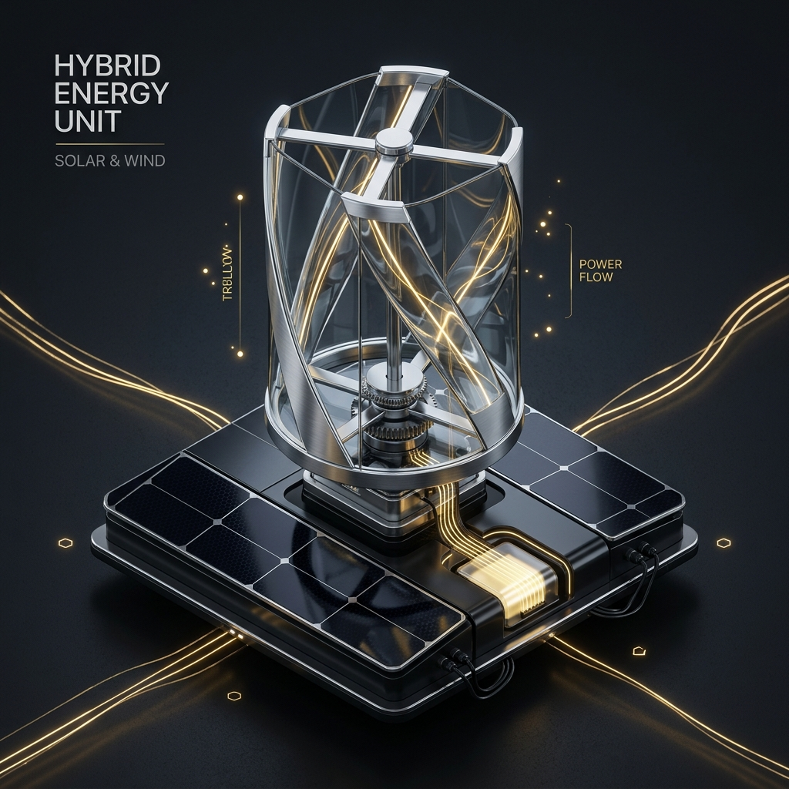

# ⚡ EnergyBae AutoLoad AI (Founder's Edition V7)



> **Revolutionizing Energy Audits with Human-Crafted Engineering and Agentic Intelligence.**

EnergyBae AutoLoad AI is an autonomous, agentic platform designed to transform raw Maharashtra MSEDCL electricity bills into production-ready solar/wind hybrid audits in under 10 seconds. 

Built for the **EnergyBae Founder's Internship Review (April 30th - May 1st)**, this project demonstrates high-fidelity AI orchestration, non-destructive data automation, and world-class industrial UI/UX design.

---

## 🚀 Live Production & Deployment
- **Live Portal:** [https://energybae-load-calculator.vercel.app](https://energybae-load-calculator.vercel.app)
- **Status:** `V7 Human-Crafted Engineering` (Latest)
- **Deployment:** Vercel Edge Runtime (Optimized for Speed)

---

## 🧠 The V7 "Human-Crafted" Revolution
This repository moves beyond generic AI templates. The V7 overhaul introduces:
- **Flagship 3D Renders:** Custom-designed hybrid energy units to anchor the visual identity.
- **Engineer's Annotations:** Handwriting-font (Caveat) AI insights that simulate a "Human-in-the-Loop" engineering workflow.
- **Architectural Sketch Layer:** A semi-transparent CAD-style grid ground the digital interface in real-world physical engineering.
- **Solar Obsidian Palette:** A sophisticated dark-mode system with 24k Solar Gold accents.

---

## 🏗 Core Technical Architecture
- **Framework:** Next.js 14 (App Router) with React 18.
- **Neural Engine:** GPT-4o Vision API with specialized MSEDCL domain-knowledge prompting.
- **Automation:** `exceljs` for non-destructive data injection into proprietary EnergyBae templates.
- **Analytics:** Recharts for high-variance consumption delta visualization.
- **Animations:** Framer Motion for non-linear, high-fidelity UI transitions.
- **Voice Intelligence:** Web Speech API for autonomous executive briefings.

---

## 🛠 Strategic Features
1. **Neural Stream Console:** Real-time visibility into the AI's Chain-of-Thought during extraction.
2. **Interactive ROI Simulator:** Live Break-Even analysis using draggable investment vectors.
3. **MSEDCL Domain Specialist:** Specifically tuned for Maharashtra's complex billing structures (HP to kW conversion, BU mapping).
4. **EnergyBae GPT:** A contextual chatbot trained on the extracted billing data for interactive consulting.

---

## 📂 Project Structure
```text
energybae-load-calculator/
├── src/app/api/         # AI & Excel Generation Gateways
├── src/app/page.tsx     # Flagship V7 Unified Interface
├── public/              # High-fidelity 3D Assets & CAD Sketch Layers
├── DIGITAL_HEROES.md    # 2-Minute Interview Pitch & Technical Q&A
└── README.md            # You are here.
```

---

## 👤 Author
**Ayush Shukla**  
*AI Engineer & Full-Stack Developer Intern Candidate*  
*EnergyBae Engineering Recruitment 2026*

---
© 2026 EnergyBae | Confidential Portfolio Piece
